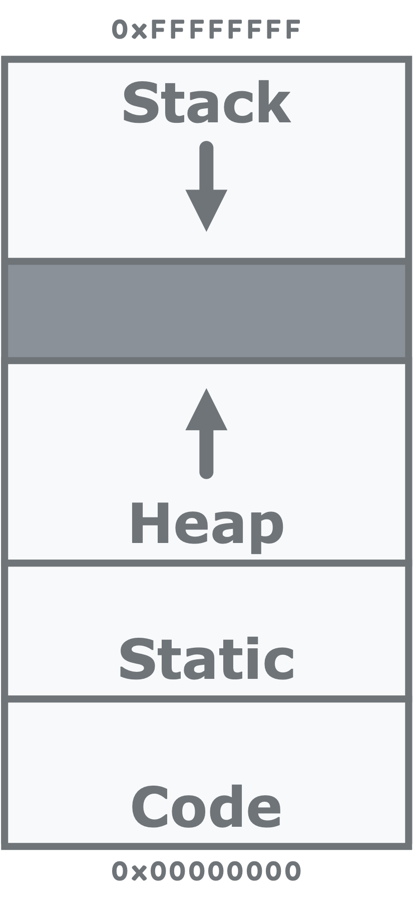

# Functions

## Learning Objectives

After this lesson, students should be able to:
- Identify if a function is ***pass-by-value*** or ***pass-by-reference***
- Identify the ***scope*** of a variable
- Specify **when** a variable is ***allocated*** and ***released***

## Basics

A ***function*** is a reusable block of code. Using them is encouraged.

Functions allow us to avoid copying code around, which would clutter things up, but also make maintenance more difficult.
Having to remember to change every block of copied code every time we wanted to make a change that affected everything can be an annoying and error-prone process.

Functions also allow us to create abstractions that hide implementation details.
For example, if I wanted to sort an array, I don't necessarily care how it is sorted, only that it happens.
The abstraction makes it easier to reuse code in other contexts for ourselves and others.

A function is defined as follows:

```
<return_type> <function_name>(<param_type1> <param_name1>, <param_type2> <param_name2>, ... )
{
    <function_body>

    return <return_expression>
}
```

Functions may also need **prototypes** if we want to use the function somewhere else in our code before it has been defined.

```
<return_type> <function_name>(<param_type1> <param_name1>, <param_type2> <param_name2>, ... );
```

To call a function, use its name followed parentheses containing valid expressions that correspond to each parameter.

```
<function_name>(<param_expression1>, <param_expression2>, ... );
```

> **Live Examples**: See the `src` directory of this repository for live example code.

## Storage-Type Modifiers (Storage-Class Specifiers)

These are modifier keywords used with variable declarations to change the scope or behavior of the declaration.

| **keyword** | **description** |
| :--- | :--- |
| **`auto`**     | default, automatic lifetime and local scope |
| **`register`** | suggestion to compiler to place variable in core register |
| **`extern`**   | no new storage allocated, brings object into local scope |
| **`static`**   | sets lifetime of storage to static (always reserved) |
| **`typedef`**  | used to define custom types, only for convenience purposes |


## Scope Definitions

A ***scope*** is a region of code.

The **File** scope contains the entire contents of a given `.c` file. At this level live globals, functions, prototypes, and typedefs.

A **Block** is any region of code encapsulated by curly braces `{}`. This includes things like functions, loops, and `if-else` patterns. Blocks can also be standalone. Variables declared within the scope of a block cannot ever be used outside of that block.

The **Function** scope contains all contents between the curly braces `{}` of a function definition. Functions are essentially named blocks that can similarly contain other blocks. You cannot define functions inside of other functions in C.

> **Live Examples**: See the `src` directory of this repository for live example code.

## Variable Lifetimes

Program memory is basically organized into:
- **Stack** – local variables defined in functions at runtime
- **Heap** – variables explicitly allocated by user at runtime
- **Static** – variables that exist for full duration of runtime
- **Code/Text** – the code itself



A variable's lifetime represents how long the variable's storage exists at runtime, based on where it exists.

- **Automatic** – Reserved on scope entry, released on scope exit. 
  - Variable stored on **stack** space
- **Static** – Reserved for entire program execution time
  - Variable stored in **static** space
- **Allocated** – Reserved and released at runtime explicitly by programmer (also called **dynamically allocated**)
  - Variable stored in **heap** space

> **Live Examples**: See the `src` directory of this repository for live example code.

## Parameter Passing

There are 2 ways to declare a function's parameters:
- **Pass-by-value**: parameters are **values**
  ```c
  void divide_values(int dividend, int divisor, int result)
  ```
  - Copies the value to be used into the function's scope.
- **Pass-by-reference**: parameters are **pointer to values**
  ```c
  void divide_values(int * dividend, int * divisor, int * result)
  ```
  - Copies an address into the function scope to access out-of-scope variables.

**Example 5**
```c
void divide_values(int dividend, int divisor, int result)
{
    result = dividend / divisor;
    dividend = dividend / divisor;
}

int main(void)
{
    int dividend = 12;
    int divisor = 6;
    int result = 0;
    divide_values(dividend, divisor, result);
    printf("dividend = %d\n", dividend); // prints ???
    printf("divisor = %d\n", divisor);   // prints ???
    printf("result = %d\n", result);     // prints ???
    return 0;
}
```

**Example 6**
```c
void divide_values(int * dividend, int * divisor, int * result)
{
    *result = *dividend / *divisor;
    *dividend = *dividend / *divisor;
}

int main(void)
{
    int dividend = 12;
    int divisor = 6;
    int result = 0;
    divide_values(&dividend, &divisor, &result);
    printf("dividend = %d\n", dividend); // prints ???
    printf("divisor = %d\n", divisor);   // prints ???
    printf("result = %d\n", result);     // prints ???
    return 0;
}
```

### Pros and Cons

Pass-by-value is generally easier to reason about, since there is no possibility for non-explicit state changes.
That is, things outside of that function's scope cannot be altered, and the function can be reasoned about entirely with respect to inputs and outputs.
This makes it less likely to shoot yourself in the foot, since you are unlikely to mistakenly modify a variable somewhere else in your code.
However, it can be unwieldy for many inputs, and can be much slower when you are dealing with structs, since you need to copy more data onto the stack.

Pass-by-reference, by contrast, enables out-of-scope modifications, allowing you to apply functions to constructs in different scopes, which can be a power ful tool.
It is also faster to pass a reference to a struct than it is to copy that struct entirely onto the stack.
Many more clever design patterns are also made possible when you can pass struct references around, but that is out of the scope of this lesson.

## Exercise 2

Write a function to reverse an array in-place, without creating a new array.

The files for Exercise 2 are located in [this repository](https://github.com/rctsang/rhit-ece230) at `exercise2`.

Download the files and follow along in your code editor.


## References

ISO/IEC 9899: TC3 [[link](http://www.open-std.org/jtc1/sc22/wg14/www/docs/n1256.pdf)]
- Scope – Section 6.2.1
- Lifetime – Section 6.2.4
- Storage-class specifiers (type modifiers) – Section 6.7.1


